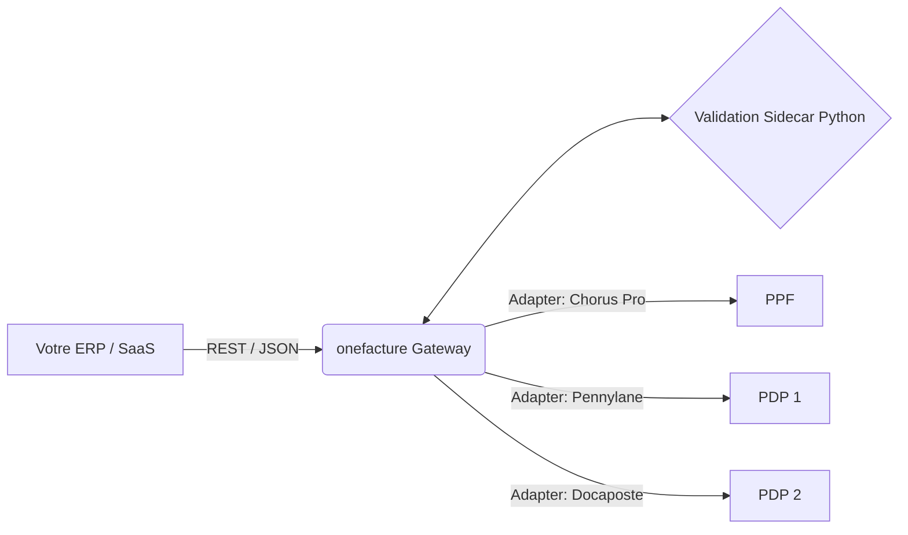

<h1 align="center">
  
  <br>
  onefacture
</h1>

<h4 align="center">La passerelle API Open Source pour la Facturation Électronique Française (Réforme 2026)</h4>

<p align="center">
  <a href="#vision--le-problème">Problème</a> •
  <a href="#la-solution--onefacture">Solution</a> •
  <a href="#architecture">Architecture</a> •
  <a href="#feuille-de-route-roadmap">Roadmap</a> •
  <a href="#démarrage-rapide">Démarrage rapide</a>
</p>

---

## 🇫🇷  Problème

À partir du **1er septembre 2026**, l'État français rend obligatoire l'émission, la transmission et la réception de factures au format électronique pour toutes les transactions B2B nationales assujetties à la TVA. Il ne s'agit pas d'un simple échange de PDF : cela implique des formats de données stricts (Factur-X, UBL, CII) et un routage via un réseau complexe de **Plateformes de Dématérialisation Partenaires (PDP)** et du **Portail Public de Facturation (PPF)** (le fameux "schéma en Y").

Pour les éditeurs d'ERP, les plateformes SaaS et les systèmes d'information internes, cela représente un cauchemar technique :
- **Fragmentation :** Il existe plus de 70 PDP immatriculées (Sage, Pennylane, Docaposte, Cegid, etc.), chacune imposant sa propre API propriétaire.
- **Complexité :** Générer des fichiers PDF/A-3 conformes avec XML embarqué (Factur-X) et les valider face à des centaines de règles métier (Schematron / AFNOR) est un défi majeur.
- **Enfermement propriétaire (Vendor Lock-in) :** Se connecter directement à une seule PDP lie la logique de facturation de votre système à leur infrastructure spécifique.

##  Solution : onefacture

**onefacture** est une API Gateway unifiée et open source qui abstrait l'intégralité de la complexité de l'écosystème de facturation électronique français.

Au lieu de développer des dizaines d'intégrations point-à-point, votre application communique avec **une seule API REST élégante**. Nous gérons le travail difficile : génération de Factur-X, validation stricte EN 16931, routage dynamique vers les PDP, et suivi du cycle de vie.

### Fonctionnalités Clés

-  **API Unifiée :** Une seule interface OpenAPI 3.1 orientée développeur pour tous vos besoins de facturation.
-  **Routage Intelligent :** Envoyez une facture ; `onefacture` interroge automatiquement l'Annuaire national et la route vers la PDP choisie par le destinataire.
-  **Validation Blindée :** Un pipeline de validation intégré à 6 couches (XSD + Schematron) garantit que vos factures ne seront jamais rejetées par l'administration fiscale.
-  **Natif Factur-X :** Génération à la volée de fichiers PDF/A-3 conformes avec XML embarqué (profils MINIMUM, BASIC, EN16931, EXTENDED).
-  **Webhooks Standardisés :** Recevez des événements de cycle de vie normalisés (ex: `invoice.submitted`, `invoice.paid`) quelles que soient les spécificités de la PDP sous-jacente.

---

##  Architecture

`onefacture` est conçu pour offrir un haut débit, une faible latence et une fiabilité à toute épreuve, en respectant les standards de connectivité **AFNOR XP Z12-013**.

**Stack Technique :**
*   **Gateway (Go 1.23+) :** La couche API hautement concurrente, le routage et la gestion des états (basée sur Fiber/Chi).
*   **Moteur de Validation (Sidecar Python) :** Gère la manipulation complexe du XML et la validation Schematron via `lxml`, assurant le respect strict de la norme AFNOR XP Z12-012.
*   **Base de données :** PostgreSQL avec `pgvector` pour les pistes d'audit immuables et l'isolation des données multi-tenants.
*   **Messagerie (Async) :** NATS ou Redis Streams pour la livraison asynchrone des webhooks et le polling des statuts PDP.



---

##  Feuille de route (Roadmap)

Nous sommes en plein développement actif pour respecter les échéances réglementaires de 2026.

- [x] **Phase 0 :** Recherche & Spécifications (Extraction des normes AFNOR, mapping XSD/Schematron).
- [x] **Phase 1 :** Fondations Core (Modèles Go, PostgreSQL, Sidecar de validation Python).
- [x] **Phase 2 :** API Gateway (CRUD Factures, définitions OpenAPI 3.1, Scalar docs).
- [x] **Phase 3 :** Adaptateurs PA — interface, registre et mock fonctionnel ; Chorus/Pennylane/Docaposte à brancher sur leurs sandboxes.
- [x] **Phase 4 :** Workers Asynchrones (Redis Streams, webhooks signés HMAC, polling lifecycle).
- [x] **Phase 5 :** Expérience Développeur (Vagues 1-4 complétées : sandbox, SDKs, PDF/A-3, Helm/obs, publication auto).

*(Consultez [ISSUES.md](./ISSUES.md) pour le backlog détaillé, [les exemples metier](./docs/examples/business-scenarios.md) pour les cas avoir/correction/rejet, et [les gates d'acceptance externes](./docs/operations/external-acceptance.md) pour les validations qui exigent des services reels).*

---

##  Démarrage rapide

### 1. Lancer via Docker Compose
```bash
git clone https://github.com/your-org/onefacture.git
cd onefacture
make dev          # Gateway Go + sidecar Python + Postgres + Redis
make migrate-up   # Applique les migrations
```

API : http://localhost:8080 · Docs Scalar : http://localhost:8080/docs · OpenAPI : http://localhost:8080/openapi.json

### 2. Émettre votre première Factur-X
```bash
curl -X POST "http://localhost:8080/v1/invoices?submit=true" \
  -H "X-API-Key: $ONEFACTURE_API_KEY" \
  -H "Content-Type: application/json" \
  -d '{
    "profile": "EN16931",
    "type_code": "380",
    "number": "INV-0001",
    "currency": "EUR",
    "issue_date": "2026-03-01",
    "seller": {
      "name": "Acme Corp",
      "siren": "732829320",
      "address": { "line1": "1 rue Cler", "postal_code": "75007", "city": "Paris", "country_code": "FR" }
    },
    "buyer": {
      "name": "Globex Inc",
      "siren": "552120222",
      "address": { "line1": "2 av Foch", "postal_code": "75116", "city": "Paris", "country_code": "FR" }
    },
    "lines": [{
      "description": "Consulting", "quantity": 10, "unit_code": "HUR",
      "unit_price": 150.00, "tax_rate": 20, "tax_category": "S"
    }]
  }'
```

---

##  Contribuer

Les contributions sont les bienvenues ! Que ce soit pour construire un adaptateur pour une PDP spécifique, améliorer le moteur de validation, ou enrichir la documentation, votre aide est essentielle pour démocratiser la facturation électronique en France.

Veuillez lire notre [Guide de contribution](./CONTRIBUTING.md) (en cours de rédaction) pour commencer.

### Verification rapide

```bash
make verify-local   # tests, smokes, manifest, YAML et actionlint locaux du backlog
make verify-sdk     # artefacts SDK installables localement
```

Les gates qui dependent de sandboxes PA, de registres publics ou d'un broker KMS deploye sont documentes dans [docs/operations/external-acceptance.md](./docs/operations/external-acceptance.md). Avant de les lancer, verifier la configuration locale et GitHub Actions:

```bash
make check-external-env
make check-github-external-config GITHUB_REPO=yawo/onefacture
```

##  Licence

Ce projet est sous licence **Apache 2.0** - voir le fichier `LICENSE` pour plus de détails.
