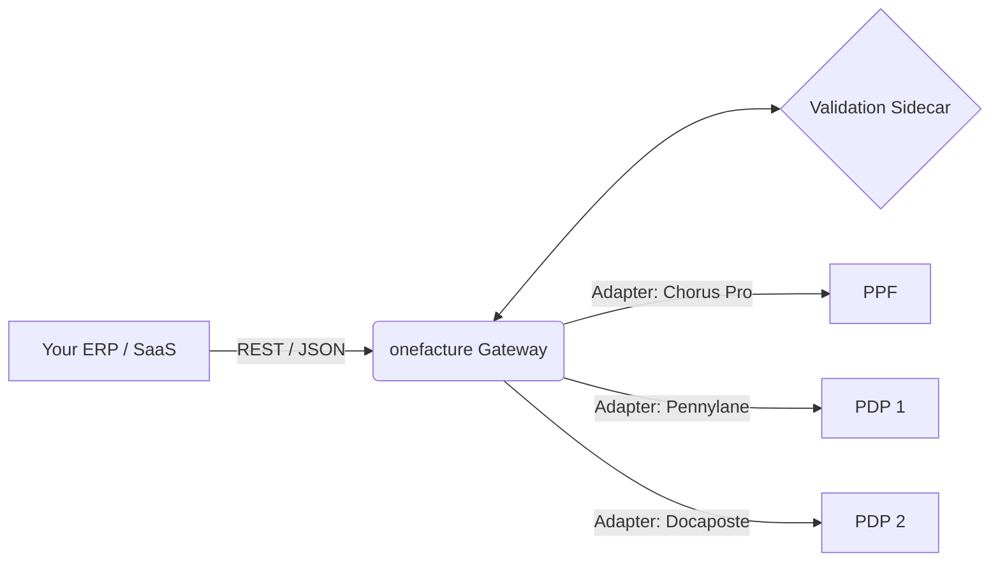

<h1 align="center">
  
  <br>
  onefacture
</h1>

<h4 align="center">The Open Source API Gateway for French E-Invoicing (2026 Mandate)</h4>

<p align="center">
  <a href="#vision--the-problem">Vision</a> •
  <a href="#how-it-works">How it Works</a> •
  <a href="#architecture">Architecture</a> •
  <a href="#roadmap">Roadmap</a> •
  <a href="#getting-started">Getting Started</a>
</p>

---

## 🇫🇷 Vision : The Problem

Starting **September 1, 2026**, the French government mandates that all B2B transactions subject to VAT must be issued, transmitted, and received electronically. This is not a simple PDF exchange; it involves strict data formats (Factur-X, UBL, CII) and routing through a complex network of **Plateformes de Dématérialisation Partenaires (PDP)** and the **Portail Public de Facturation (PPF)** via a "Y" schema.

For ERPs, SaaS platforms, and internal enterprise systems, this presents a nightmare:
- **Fragmentation:** There are over 70+ accredited PDPs (Sage, Pennylane, Docaposte, Cegid, etc.), each with its own proprietary API.
- **Complexity:** Generating compliant Factur-X PDFs with embedded XML and validating them against hundreds of Schematron business rules is technically daunting.
- **Vendor Lock-in:** Connecting directly to a single PDP ties your system's core invoicing logic to their specific infrastructure.

## 💡 The Solution: onefacture

**onefacture** is a unified, open-source API gateway that abstracts the entire complexity of the French e-invoicing ecosystem. 

Instead of building dozens of point-to-point integrations, your application talks to **one single, elegant REST API**. We handle the heavy lifting: Factur-X generation, strict EN 16931 validation, PDP routing, and lifecycle status tracking.

### Key Features

- 🔌 **Unified API:** A single, developer-friendly OpenAPI 3.1 interface for all your invoicing needs.
- 🚦 **Smart Routing:** Send an invoice; `onefacture` automatically queries the national directory (Annuaire) and routes it to the recipient's chosen PDP.
- 🛡️ **Ironclad Validation:** Built-in 6-layer validation pipeline (XSD + Schematron) ensures your invoices are never rejected by the tax authority.
- 📄 **Factur-X Native:** Generate compliant PDF/A-3 files with embedded XML (MINIMUM, BASIC, EN16931, EXTENDED profiles) on the fly.
- 🔄 **Standardized Webhooks:** Receive normalized lifecycle events (e.g., `invoice.submitted`, `invoice.paid`) regardless of the underlying PDP's quirks.

---

## 🏗️ Architecture

`onefacture` is built for high throughput, low latency, and rock-solid reliability, adhering to the **AFNOR XP Z12-013** connectivity standards.

**Core Stack:**
*   **Gateway (Go 1.23+):** The highly concurrent API layer, routing, and state management (Fiber/Chi).
*   **Validation Engine (Python Sidecar):** Handles complex XML manipulation and Schematron validation via `lxml`, ensuring strict adherence to AFNOR XP Z12-012.
*   **Database:** PostgreSQL with `pgvector` for immutable audit trails and multi-tenant data isolation.
*   **Messaging:** NATS/Redis Streams for async webhook delivery and PDP status polling.



---

## 🛣️ Roadmap

We are currently in active development to meet the 2026 mandate deadlines.

- [x] **Phase 0:** Research & Specifications (AFNOR extraction, XSD/Schematron mapping).
- [ ] **Phase 1:** Core Foundations (Go models, PostgreSQL, Python Validation Sidecar).
- [ ] **Phase 2:** API Gateway (Invoicing CRUD, OpenAPI 3.1 definitions).
- [ ] **Phase 3:** Adapters (Chorus Pro/PPF, Docaposte, Pennylane, Cegid).
- [ ] **Phase 4:** Async Workers (Webhooks, Lifecycle tracking via NATS).
- [ ] **Phase 5:** Developer Experience (Public Sandbox, Python/TS SDKs).

*(See [ISSUES.md](./ISSUES.md) for the detailed, actionable backlog).*

---

## 🚀 Getting Started (Coming Soon)

*Note: The project is currently in the initial setup phase. The following is a preview of the developer experience.*

### 1. Run via Docker Compose
```bash
git clone https://github.com/your-org/onefacture.git
cd onefacture
make dev # Starts Go Gateway, Python Sidecar, Postgres, and Redis
```

### 2. Issue your first Factur-X
```bash
curl -X POST http://localhost:8080/v1/invoices \
  -H "X-API-Key: YOUR_TEST_KEY" \
  -H "Content-Type: application/json" \
  -d '{
    "profile": "EN16931",
    "seller": { "siren": "123456789", "name": "Acme Corp" },
    "buyer": { "siren": "987654321", "name": "Globex Inc" },
    "totals": { "tax_exclusive_amount": 100.00, "tax_amount": 20.00 }
  }'
```

---

## 🤝 Contributing

We welcome contributions! Whether you are building an adapter for a specific PDP, improving the validation engine, or enhancing the documentation, your help is essential to democratize French e-invoicing.

Please read our [Contributing Guidelines](./CONTRIBUTING.md) (Drafting in progress) to get started.

## 📄 License

This project is licensed under the **Apache License 2.0** - see the `LICENSE` file for details.
